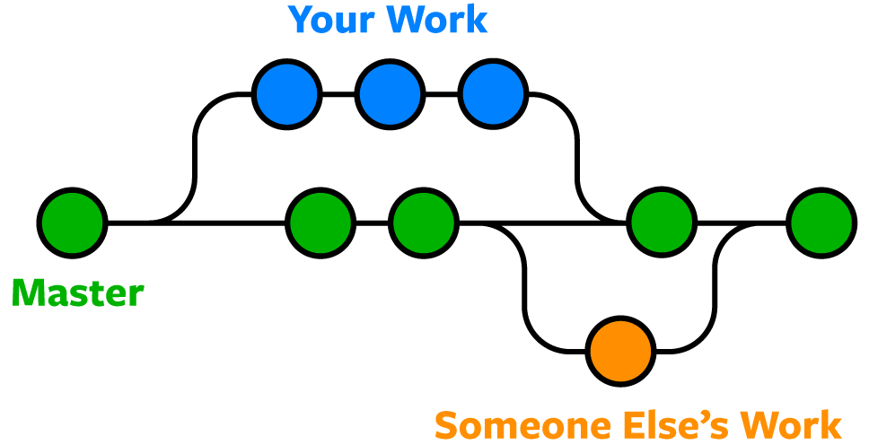

# Python Project Framework for Beginners

This repository aims to provide a simple, easy-to-understand custom framework for data science projects. Today, individual or small-scale projects tend to expend little to no effort in providing the means of understanding and reimplementing their code bases. Projects that are not shipped to production or built with scalability in mind suffer from a lack of structure and standardization. The aggregated tools and recommendations in this repository provide a barebones framework that all Python projects should adopt in the absence of high-order frameworks (e.g. [Django](https://www.djangoproject.com/)). Certain tools (such as Black or Pre-commit) may be suitable in tandem with other frameworks.

The IDE of choice was [Visual Studio Code](https://en.wikipedia.org/wiki/Visual_Studio_Code) (VSCode). Other IDEs such as [Sublime](https://www.sublimetext.com/) or [PyCharm](https://www.jetbrains.com/pycharm/) or [RStudio](https://www.rstudio.com/) (for R users) pose accessibility limitations. While VSCode has its own disadvantages, it offers the most amount of flexibility in contrast to other IDEs and is one of the most popular, open-source IDEs.

# Introduction of Tools

The following tools were considered when building this framework. Further considerations may be made depending on the balance of simplicity (ease of implementation) and benefit (usefulness of the tool/framework).

1. [Git](https://git-scm.com/)

   Git is one of the most basic and important tools to adopt for any project. This is crucial for tracking changes, collaborative efforts between team members, and provides version control functionalities. Git can be conceptualized as such:

   

   Figure 1: Git Flowchart

   

   Figure 2: Git Collaboration Conceptualization

2. [Anaconda](https://www.anaconda.com/)

   Anaconda is a virtual environment and package manager which allows for reproducible environments. Utilizing virtual environments and managing packages is integral when sharing code or working on different machines. Additionally, it allows users to use different versions of python or packages depending on the project.

3. [Black](https://black.readthedocs.io/en/stable/)

   Black is a code formatting tool that forcefully changes your code according to the [PEP8 style guide](https://www.python.org/dev/peps/pep-0008/).

4. [Flake8](https://flake8.pycqa.org/en/latest/)

   Flake8 is a code checking tool that checks whether your code has any errors.

5. [Pre-commit](https://pre-commit.com/)

   Pre-commit checks and identifies issues before commit code for code reviews. It scans all files that are staged for a commit and forces the user to fix issues (if any) before restaging the commit.

# How to Download

1. [Download Git](https://git-scm.com/downloads)

2. [Download Anaconda](https://www.anaconda.com/products/individual)

3. Download **Black** in terminal with one of either:

   `pip install black`
   `conda install --channel=conda-forge black` (after cond activation)

4. Download **Flake8** in terminal with one of either:

   `pip install flake8`
   `conda install flake8` (after conda activation); [More information](https://code.visualstudio.com/docs/python/linting)

5. Download **Pre-commit** in terminal with one of either:

   `pip install pre-commit`
   `conda install --channel=conda-forge pre-commit` (after conda activation)

# Set up

1. [Setting up Git](https://git-scm.com/book/en/v2/Getting-Started-First-Time-Git-Setup)

2. Setting up Anaconda

   If this is your first time installing or setting up Anaconda, you need to start by initializng Anaconda in the terminal with `conda init`. Afterwards, run `conda env list` to see the list of environments. There should only be one environment named `(base)` and the asterisk mark shows you which environment you are currently in. If this command was unsuccessful due to Anaconda not initializing properly, read [this](https://stackoverflow.com/questions/44597662/conda-command-is-not-recognized-on-windows-10).

   Afterwards, run the following commands to create and activate your Anaconda

   - Creating environment: `conda create --name <environment_name> python=<python_version> -y`
   - Activating environment: `conda activate <environment_name>`
   - Deactivating environment: `conda deactivate`

   Some general purpose commands include:

   - List of environments: `conda env list`
   - List of packages in environment: `conda list`
   - Deletes an environment: `conda env remove --name <environment_name>`

   Packages can be installed by:

   - Installs packages from [Anaconda.org](https://anaconda.org/): `conda install <package_name>`
   - Installs packages from [conda-forge](https://conda-forge.org/): `conda install --channel=conda-forge <package_name>`
   - Installs packages from [r channel on Anaconda](https://anaconda.org/r/repo): `conda install --channel=r <package_name>`
   - Installs packages using [mamba](https://mamba.readthedocs.io/en/latest/user_guide/mamba.html#): `mamba install <package_name>`
   - Installs packages using [pip](https://pip.pypa.io/en/stable/cli/pip_install/): `pip install <package_name>`

   Other r packages not available on Anaconda can be installed the methods outlined [here](https://stackoverflow.com/questions/34705917/how-to-install-r-packages-that-are-not-available-in-r-essentials).

3. Setting up **Black**

   Go into **File** > **Preferences** > **Settings** and change **Python › Formatting: Provider** to **black**. If your options are different, look online for a solution.

4. Setting up **Flake8**

   Open the **Command Palette** with `Ctrl + Shift + P` then type **Python: Run Linting**. Adds `"python.linting.<linter>Enabled": true` to your VSCode settings. Add `"python.linting.lintOnSave": true` to your VSCode settings as well to activate linter on save.

5. Setting up **Pre-commit**

   Check pre-commit version by:
   `pre-commit --version`

   Add a file in the root directory of the git repository titled `.pre-commit-config.yaml` and include the repo link, rev, hook, and id. An example can be found in the root folder of this repository. Afterwards, install the hooks with `pre-commit install` which adds the hooks to `.git/hooks/`. A more comprehensive list of hooks is available [here](https://pre-commit.com/hooks.html).

# Saving Python Version and Package Versions

To save the conda environment specifications, run one of the following commands:

`pip freeze > requirements.txt`
`conda env export --name <environment_name> --file environment.yaml`

If there is an issue with the `conda` command exporting build information, add `--no-builds` at the end as suggested [here](https://stackoverflow.com/questions/55554431/conda-fails-to-create-environment-from-yml). You can also choose to curate your own `environment.yaml` file. For pip, make sure to install libraries with `pip` and export packages with `pip list --format=freeze > requirements.txt` if you are encountering a similar issue.

Afterwards, you can either create a new environment with the packages simultaneously:

`conda env create -f environment.yaml`

Or create the environment separately, and install packages with `pip install -r requirements.txt` while Anaconda is still activated.

# Project Layout

The project tree of the most pertinent items can be described briefly.

    python_project_framework/
     │
     ├── images/
     │   ├── git_concept1.jpg
     │   └── git_concept2.jpg
     │
     ├── environment.yaml / requirements.txt
     └── README.md

# Notes

1. Conflicts between `conda` and `pre-commit`

There's a known conflict issue between `conda` and `pre-commit` originating from how git hooks are generated for python versions under `3.9`. `pre-commit install` python executables are stored in generated git hooks, but a `conda` environment executes the installed python version only when the environment is activated. To circumvent this issue, there are three possible ways to solve this, as documented [here](https://github.com/conda-forge/pre-commit-feedstock/issues/9):

- Activate the environment in the terminal, open vscode from the activated terminal using the command `code .` **(tested)**
- Create [exec-wrappers](https://github.com/gqmelo/exec-wrappers) and [conda-wrappers](https://github.com/conda-forge/conda-wrappers-feedstock) that mimic a conda activation before running the executable **(not tested)**
- Reinstall conda with python versions `3.9` or `3.10` as this issue is allegedly fixed in later python versions **(not tested)**
